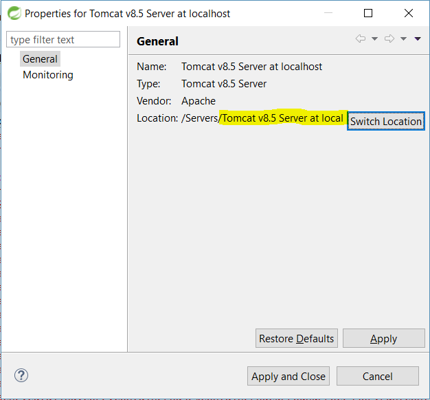

# Todo With Servlets
This is a simple TODO app implemented with pure servlet 3.1 and a dash of vanilla javascript and some H2 SQL.

## Deploying locally
Clone this repository into a convenient location then navigate to the root of the project directory from the command line and execute
```bash
$ mvn package
```
This will produce an artifact called `todo.war` in the target directory which you can deploy to the servlet 3.1 container of your choice.

## Configuring Tomcat
If you do not already have a Tomcat installation prepared, download [Tomcat 8.5](https://tomcat.apache.org/download-80.cgi#8.5.32) from Apache and extract it to a convenient location on your machine.

### App data source requirements
This app expects a datasource backed by an [H2 database](http://www.h2database.com) to be provided by its host container with the JNDI name of `todoDS`. It is configured by default to treat this data source as an in-memory database and populate it with some example data on app start up. You can disable this behavior by changing the context parameter `loadExampleDB` to be `false` in `web.xml`

### Installing the H2 driver in Tomcat
To enable our Tomcat installation to provide this in-memory data source we must first install the H2 driver by downloading [this .jar file](http://repo2.maven.org/maven2/com/h2database/h2/1.4.197/h2-1.4.197.jar) and copying it into the `lib` directory within our Tomcat installation directory.

### Setting up a connection pool in Tomcat
In order to let Tomcat efficiently manage the lifecycle of our database connections, we need to define a connection pool pointed at the H2 database we installed.

Navigate to the `conf` folder in the Tomcat installation directory and open up the file `server.xml`. Add the following entry under the `GlobalNamingResources` node:
```xml
<Resource auth="Container" 
          driverClassName="org.h2.Driver" 
          maxTotal="20" 
          maxIdle="10" 
          maxWaitMillis="-1" 
          name="todoCP"
          type="javax.sql.DataSource" 
          url="jdbc:h2:mem:todo" 
          username="sa" 
          password="" /> 
```
### Exposing the connection pool as a JNDI resource
Next we need to instruct Tomcat to make this data source available to our app as a JNDI resource. Open the file `context.xml` (again in the `conf` directory) and add this entry under the `context` node:
```xml
<ResourceLink global="todoCP" 
              name="jdbc/todoDS" 
              type="javax.sql.DataSource"/>
```

## Setting up STS to use Tomcat as configured
After using Spring Tools Suite to import the todo app as an exiting project and deploying it to your Tomcat server in the usual way, you may discover that the app is throwing exceptions or failing to deploy because STS is using its own internal Tomcat configuration and ignoring yours

To fix this issue, right-click on the Tomcat server entry in the Servers panel and go to its properties. You will see a configuration screen where you can choose the location of the Tomcat configuration to use. Click Switch Location button to cycle through different options until you see your Tomcat server.


